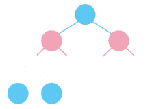

<h1 align="center">
    expr
</h1>

<p align="center">
    
</p>

An expression parser and evaluator for infix mathematical expressions. Can be used to parse expressions into expression trees. It can then evaluate these trees. It uses the Shunting Yard Algorithm for converting a vector of tokens (obtained by the lexer) to construct the tree.

## Building the REPL

The REPL can be built using the make file's repl target.

```console
> make repl
```

<p align="center">
    
</p>


## Usage

### Evaluating an expression tree
```Cpp
#include "expr.hxx"

int main(void) {
    std::string expr = "40 + (1 + 1)";
    Expr_Tree* tree = Parse(expr);
    std::cout << expr << " = " << tree->eval() << std::endl;
}
```

```console
> 40 + (1 + 1) = 42
```

implicit multiplication is supported

```Cpp
std::string expr = "5(2 + 1)";
Expr_Tree* tree = Parse(expr);
std::cout << expr << " = " << tree->eval() << std::endl;
```

```console
> 5(2 + 1) = 15
```

#### Setting variables
```cpp
std::string expr = "x + 1";
Expr_Tree* tree = Parse(expr);
tree->set_var("x", 41.0);
std::cout << expr << " = " << tree->eval() << std::endl;
```

```console
> x + 1 = 42
```

#### Functions
Functions must be of the form
```cpp
typedef float (* function)(float);
```
The Tokenizer recognizes functions as identifiers with a preceeding '\(' character. 

Function identifiers are associated with pointers to functions in the Expression Tree's fns field (a std::unordered_map<std::string, function>). At the moment, only functions of a single variable are supported. In the fututure multivariable functions are likely to be supported.

```cpp
#include <math.h>

std::string expr = "e^(sin((1/2) - (100/200)))";
Expr_Tree* tree = Parse(expr);
tree->set_fun("sin", &sin);
tree->set_var("e", std::exp(1.0));
std::cout << expr << " = " << tree->eval() << std::endl;
```

```console
> e^(sin((1/2) - (100/200))) = 1
```

or

```cpp
float succ(float x) {
    return x + 1.0; 
}

std::string expr = "succ(x)";
Expr_Tree* tree = Parse(expr);
tree->set_var("x", 41.0);
tree->set_fun("succ", &succ);
std::cout << expr << " = " << tree->eval() << std::endl;
```

```console
> succ(x) = 42
```

#### Standard library of functions and constants

By default expr defines a standard library of functions and constants which can be loaded into any Expr_Tree.

```cpp
Expr_tree* tree = Parse("ln(e^2)");
// load in the constants and functions defined in the standard library
tree->load_stdlib();
std::cout << "ln(e^2)" << " = " << tree->eval() << std::endl;
```

```console
> ln(e^2) = 2
```

Currently the standard library defines the following functions

| Identifier   |    Pointer     | Defined In |
| -----------  | -------------- | -----------| 
| sin          |  sinf          | math.h     |
| cos          |  cosf          | math.h     |
| tan          |  tanf          | math.h     |
| log          |  logf          | math.h     |
| ln           |  logf          | math.h     |
| log2         |  log2f         | math.h     |
| log10        |  log10         | math.h     |
| sinh         |  sinh          | math.h     |
| cosh         |  cosh          | math.h     |
| tanh         |  tanh          | math.h     |
| exp          |  expf          | math.h     |
| ceil         |  ceilf         | math.h     |
| floor        |  floorf        | math.h     |
| abs          |  fabs          | math.h     |
| sqrt         |  sqrtf         | math.h     |
| cbrt         |  cbrtf         | math.h     |

and the following constants

| Identifier | Definition |
| ---------- | ---------- | 
| pi         |  M_PI      |
| e          |  M_E       |

### Compiling Expression Trees to LaTeX

Expr_Tree objects can be compiled to LaTeX. For example, 

```cpp
std::string expr = "e^(sin((1/2) - (100/200)))";
Expr_Tree* twee = Parse(expr);
std::cout << "LaTeX: " << twee->latex(0) << std::endl;
```

```console
>  LaTeX: e^{sin(\frac{1}{2}-\frac{100}{200})}
```

$$e^{sin(\frac{1}{2}-\frac{100}{200})}$$

which looks correct.

the integer parameter controls the decimal precision when printing floating point nodes.

### Expression Simplification

Expr can reduce expressions.

```cpp
std::string expr = "e^(sin((1/2) - (100/200)))";
std::unique_ptr<Expr_Tree> tree(Parse(expr));
tree->load_stdlib();
std::cout << "Original Expression: "
          << tree->latex(0) << std::endl;
Expr_Tree* simplified = tree->simplify();
std::cout << "Simplified Expression: "
          << simplified->latex(0) << std::endl;
```

```console
> 
Original Expression: e^{sin(\frac{1}{2}-\frac{100}{200})}
Simplified Expression: 1
```

constant subtrees (subtrees without variable nodes) are precomputed during simplification. Certain reduction rules are implemented, for example: if a multiplication node's right or left subtrees is constant and is equal to 0, the entire tree is replaced with a node containing a 0. 


```cpp
/*
    ( * )       L=0||R=0       ( 0 )
    /   \       ====>          /   \
   L     R
*/
```

```cpp
Expr_Tree* tree(Parse("cos(x + 2)/(1 + 2 + 3 + 4 + (10/2))"));
Expr_Tree* simplified = tree->simplify();
std::cout << simplified->latex(0);
```

```console
> \frac{cos(x+2)}{15}
```

### Converting an expression to postfix
```cpp
std::string expr = "1 + 1";
infix_to_postfix(expr);
```

```console
> 1 1 +
```

### Tokenizing an expression
```cpp
#include "lexer.hxx"

int main(void) {
    std::string expr = "40 + (1 + 1)";
    Lexer lx = Lexer(expr);
    lx.tokenize();
    display_tokens(&lx);
}
```

```console
> 
Token<Type: Num | Lexeme: 40>
Token<Type: Sum | Lexeme: +> 
Token<Type: lp | Lexeme: (>  
Token<Type: Num | Lexeme: 1> 
Token<Type: Sum | Lexeme: +> 
Token<Type: Num | Lexeme: 1> 
Token<Type: rp | Lexeme: )>  
```
